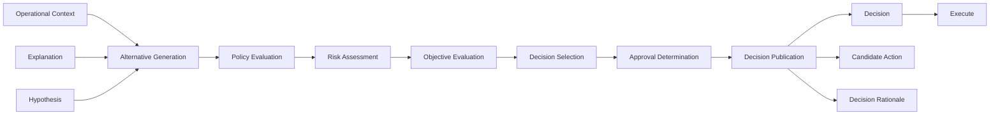

<p align="left">
  
</p>

# OCAS-10 — Domain 04: Decide

| Property | Value |
|----------|-------|
| Document | OCAS-10 |
| Domain | Decide |
| Version | 1.0 |
| Status | Draft |
| Parent | OpsiMind Cognitive Architecture Specification |

---

# 1. Purpose

The **Decide** domain transforms operational **Understanding** into
intentional **Courses of Action**.

While the Reason domain answers:

> **"Why is this happening, and what does it mean?"**

the Decide domain answers:

> **"What should be done?"**

Decide evaluates possible responses, considers objectives, constraints,
policies, and risks, and selects the most appropriate course of action.

The Decide domain defines intent.

It does **not** execute actions.

---

# 2. Mission

The mission of the Decide domain is:

> **Select the most appropriate operational response based on contextual
understanding, organizational objectives, governance policies, and risk
evaluation.**

Decision making balances competing priorities rather than simply reacting to
events.

---

# 3. Cognitive Question

The Decide domain continuously answers:

> **"What should we do?"**

Examples include:

- Restart the affected service.
- Scale the deployment horizontally.
- Delay remediation until business hours.
- Notify the operations team.
- Roll back the latest deployment.
- Continue monitoring without intervention.
- Escalate the incident to a human operator.
- Take no action because the condition is expected.

A decision represents an evaluated intent—not an executed action.

---

# 4. Responsibilities

The Decide domain owns the following architectural responsibilities.

## 4.1 Alternative Generation

Identify feasible response options for the current operational context.

Examples include:

- Restart
- Scale
- Roll back
- Fail over
- Ignore
- Escalate
- Observe further
- Notify
- Execute workflow

Multiple alternatives may exist for the same situation.

---

## 4.2 Policy Evaluation

Evaluate organizational policies that influence decisions.

Examples:

- Security policies
- Compliance requirements
- Business rules
- Maintenance windows
- Cost constraints
- Change management rules
- Approval requirements

Policies constrain what actions are permissible.

---

## 4.3 Risk Assessment

Estimate the operational risks associated with each candidate action.

Risk dimensions may include:

- Availability impact
- Business impact
- Security exposure
- Financial cost
- Recovery complexity
- Customer experience
- Probability of failure

Risk assessment informs but does not solely determine the decision.

---

## 4.4 Objective Evaluation

Consider organizational objectives when comparing alternatives.

Examples:

- Maximize availability
- Minimize recovery time
- Reduce operational cost
- Preserve data integrity
- Protect customer experience
- Maintain regulatory compliance

Objectives may conflict and require trade-off analysis.

---

## 4.5 Decision Selection

Select the most appropriate operational response.

Selection shall consider:

- Context
- Evidence
- Policies
- Risks
- Objectives
- Confidence
- Human oversight requirements

The selected response becomes the authoritative Decision.

---

## 4.6 Approval Determination

Determine whether the selected Decision requires human approval before
execution.

Approval requirements may depend on:

- Operational risk
- Organizational policy
- Change classification
- Business criticality
- Regulatory obligations

Not all Decisions are immediately executable.

---

## 4.7 Decision Publication

Publish immutable Decision objects for downstream execution.

Published Decisions become the authoritative intent for the Execute domain.

---

# 5. Inputs

The Decide domain consumes:

| Input | Source |
|--------|--------|
| Operational Context | Reason |
| Explanation | Reason |
| Hypothesis | Reason |

Implementations may additionally consume policy repositories, governance
rules, and organizational objectives, but these remain supporting inputs
rather than canonical cognitive information objects.

---

# 6. Outputs

The Decide domain publishes the following canonical information objects.

| Information Object | Owner |
|--------------------|-------|
| Decision | Decide |
| Candidate Action | Decide |
| Decision Rationale | Decide |

These objects define the intended operational response.

---

# 7. Canonical Information Objects

## Decision

A Decision represents the selected operational intent.

A Decision specifies **what should be done**, but not **how it is executed**.

Typical attributes include:

- Selected action
- Priority
- Target
- Preconditions
- Approval status
- Confidence
- Timestamp

---

## Candidate Action

A Candidate Action represents a feasible response considered during decision
evaluation.

Each Candidate Action includes its own estimated benefits, risks, and
constraints.

Candidate Actions provide transparency into the decision-making process,
even when not selected.

---

## Decision Rationale

A Decision Rationale records why a particular Decision was selected.

It shall reference:

- Operational Context
- Supporting Explanation
- Evaluated risks
- Applied policies
- Organizational objectives
- Confidence assessment

Decision Rationales provide governance and auditability.

---

# 8. Internal Capability Map

```
                    +----------------------+
                    |       Decide         |
                    +----------------------+
                               |
      +------------------------+------------------------+
      |                        |                        |
Alternative Generation   Policy Evaluation     Risk Assessment
      |                        |                        |
      +------------------------+------------------------+
                               |
                      Objective Evaluation
                               |
                      Decision Selection
                               |
                     Approval Determination
                               |
                      Decision Publication
                               |
        Decision / Candidate Action / Decision Rationale
```

---

# 9. Information Ownership

Decide is the authoritative owner of:

- Decision
- Candidate Action
- Decision Rationale

No downstream domain may reinterpret or replace a published Decision.

Execute consumes Decisions but does not redefine them.

---

# 10. Domain Boundaries

## Decide Owns

- Alternative generation
- Policy evaluation
- Risk assessment
- Objective evaluation
- Decision selection
- Approval determination
- Decision publication

## Decide Does NOT Own

- Knowledge management
- Operational reasoning
- Action execution
- Outcome evaluation
- Organizational learning

---

# 11. Domain Invariants

The Decide domain shall always satisfy the following architectural
invariants.

## 11.1 Every Decision Shall Be Justified

Every published Decision shall include a Decision Rationale.

The rationale shall reference:

- Operational Context
- Supporting Explanation
- Evaluated risks
- Applied policies
- Organizational objectives

A Decision without an explicit rationale shall not be published.

---

## 11.2 Decision Shall Not Imply Execution

A published Decision represents intent.

Execution is the responsibility of the Execute domain.

```
Reason
    │
    ▼
Decision
    │
    ▼
Execute
```

No operational changes shall occur directly within the Decide domain.

---

## 11.3 Policy Compliance Is Mandatory

Every Decision shall be evaluated against applicable organizational policies.

Examples include:

- Security controls
- Compliance requirements
- Change management rules
- Maintenance windows
- Business continuity policies

A Decision that violates mandatory policy constraints shall not be published.

---

## 11.4 Human Approval Is Explicit

When required by policy or risk, a Decision shall explicitly indicate that
human approval is required before execution.

Approval requirements are part of the Decision itself rather than an
implementation-specific concern.

---

## 11.5 Candidate Actions Are Preserved

The evaluated Candidate Actions shall remain available for traceability and
post-incident analysis.

Retaining rejected alternatives enables:

- auditability
- decision review
- continuous improvement
- learning from trade-offs

---

# 12. Quality Attributes

The Decide domain emphasizes the following quality attributes.

## Governance

Decision making shall consistently enforce organizational policies and
constraints.

---

## Explainability

Every Decision shall include sufficient information for humans to understand
why it was selected.

---

## Consistency

Equivalent operational contexts should produce equivalent decisions when the
same objectives and policies apply.

---

## Flexibility

Decision logic shall support changes to policies, objectives, and risk models
without changing architectural responsibilities.

---

## Auditability

Decision history, rationales, and evaluated alternatives shall remain
available for inspection.

---

## Scalability

The architecture shall support large-scale automated decision making across
many independent operational domains.

---

# 13. Domain Interactions

The Decide domain communicates only with adjacent cognitive domains.

## Upstream

Consumes:

- Operational Context
- Explanation
- Hypothesis

Published by:

- Reason

---

## Downstream

Publishes:

- Decision
- Candidate Action
- Decision Rationale

Consumed by:

- Execute

```
+------------------+
|      Reason      |
+------------------+
         │
         ▼
Context / Explanation / Hypothesis
         │
         ▼
+------------------+
|      Decide      |
+------------------+
         │
         ├────────────► Decision
         ├────────────► Candidate Action
         └────────────► Decision Rationale
                         │
                         ▼
                 +------------------+
                 |     Execute      |
                 +------------------+
```

Decide has no direct dependency on Evaluate or Learn.

---

# 14. Architectural Rationale

Separating **Decision Making** from **Execution** is fundamental to the
governance model of OpsiMind.

Many automation platforms combine these responsibilities, making it difficult
to explain, review, or intervene before actions are taken.

OpsiMind intentionally introduces an explicit decision stage.

## Intent Before Action

A Decision represents **intent**.

Execution represents **behavior**.

This distinction allows:

- review before action
- approval workflows
- policy validation
- simulation
- dry-run execution
- staged deployment

without changing the cognitive pipeline.

---

## Governance and Human Oversight

Not every operational situation should be resolved autonomously.

The Decide domain enables:

- human-in-the-loop operation
- human-on-the-loop supervision
- fully autonomous execution

through explicit approval requirements rather than implementation-specific
logic.

---

## Separation of Concerns

Reason focuses on understanding.

Decide focuses on selecting a response.

Execute focuses on carrying out that response.

Each domain has a single, well-defined responsibility, reducing coupling and
simplifying evolution.

---

## Explainable Automation

Automation without justification reduces trust.

By publishing Decision Rationales alongside Decisions, OpsiMind enables
operators to understand not only **what** will happen but also **why** that
course of action was selected.

---

# 15. Future Evolution

Future implementations of the Decide domain may introduce:

- Multi-objective optimization
- Reinforcement learning for policy tuning
- Adaptive risk models
- Cost-aware decision strategies
- Business-impact optimization
- Digital twin simulations
- What-if analysis
- Collaborative multi-agent decision making

These capabilities enhance decision quality while preserving the
architectural responsibility of the Decide domain.

---

# 16. Mermaid Diagram



---

# 17. References

This chapter should be read together with:

- OCAS-04 — Cognitive Processing Model
- OCAS-05 — Cognitive Information Model
- OCAS-09 — Reason
- OCAS-11 — Execute
- OCAS-14 — Cross-Cutting Capabilities (Governance and Policy)

---

# 18. Summary

The Decide domain is the intent formation engine of OpsiMind.

Its responsibility is to transform contextual understanding into justified,
policy-compliant operational Decisions.

By separating **reasoning**, **decision making**, and **execution**, the
architecture enables explainable automation, governance, human oversight, and
progressive autonomy without sacrificing transparency or control.

A Decision is an explicit statement of **what should be done**. Whether,
when, and how that intent is executed is delegated to the Execute domain,
preserving a clear boundary between cognitive intent and operational action.