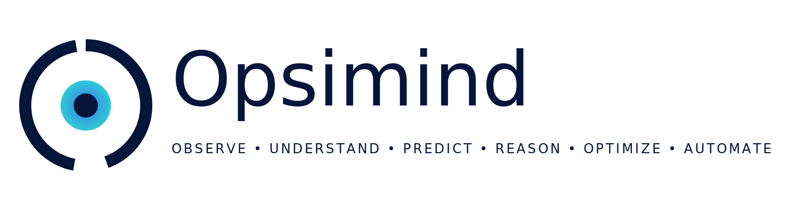

<p align="left">
  
</p>

# OCAS-06 — Domain 06: Integration

| Property | Value |
|----------|-------|
| Document | OCAS-06 |
| Domain | Integration |
| Version | 1.0 |
| Status | Draft |
| Parent | OpsiMind Cognitive Architecture Specification |

---

# 1. Purpose

The **Integration** domain is responsible for acquiring operational information
from external environments and transforming it into trusted, normalized
canonical signals that can be consumed by the cognitive architecture.

Integration is the boundary between the external operational ecosystem and the
internal cognitive world of OpsiMind.

It answers the first cognitive question:

> **"What operational information is available?"**

Integration does **not** perform reasoning, correlation, anomaly detection, or
decision making.

Its responsibility ends once trusted canonical signals have been published.

---

# 2. Mission

The mission of the Integration domain is:

> **Acquire, validate, normalize, enrich, and publish trusted operational
signals from heterogeneous operational environments.**

Every subsequent cognitive domain depends on the quality of the information
produced by Integration.

---

# 3. Cognitive Question

Integration continuously answers:

> **What information exists in the operational environment?**

Unlike later domains, Integration does not attempt to interpret meaning.

For example:

- A CPU metric exists.
- A Kubernetes Event occurred.
- A log entry was produced.
- A trace span completed.
- A configuration changed.

Those are facts—not interpretations.

---

# 4. Responsibilities

Integration owns the following architectural responsibilities.

## 4.1 Resource Discovery

Discover operational resources capable of producing information.

Examples:

- Kubernetes clusters
- Virtual machines
- Physical servers
- Databases
- Message brokers
- APIs
- Cloud services
- SaaS platforms
- Network devices

Discovery may occur through:

- APIs
- Cloud providers
- Service registries
- Configuration repositories
- Discovery protocols
- Plugins

---

## 4.2 Information Acquisition

Collect operational information from discovered resources.

Supported categories include:

- Metrics
- Logs
- Traces
- Events
- Alerts
- Configuration
- Inventory
- Topology
- Health information
- External business events

Acquisition may be:

- Pull
- Push
- Streaming
- Batch
- Event-driven

The acquisition mechanism is implementation-specific and therefore outside the
scope of OCAS.

---

## 4.3 Validation

Validate incoming information before it enters the cognitive architecture.

Typical validation includes:

- Schema validation
- Timestamp validation
- Source authentication
- Duplicate detection
- Integrity checks
- Required field validation

Invalid information shall not become canonical operational signals.

---

## 4.4 Normalization

Operational sources expose different schemas.

Integration converts them into canonical representations.

Examples:

Vendor Metric
↓
Canonical Signal

Vendor Log
↓
Canonical Signal

Cloud Event
↓
Canonical Signal

Normalization enables every downstream domain to operate independently of
vendor-specific formats.

---

## 4.5 Enrichment

Integration may enrich information using externally available metadata.

Examples include:

- Resource identifiers
- Environment
- Region
- Cloud account
- Namespace
- Labels
- Tags
- Ownership metadata

Enrichment shall never infer operational meaning.

Semantic interpretation belongs to later cognitive domains.

---

## 4.6 Publication

Publish validated canonical signals.

Published signals become immutable architectural facts.

Subsequent domains consume published signals without modifying them.

---

# 5. Inputs

Integration accepts information originating outside the cognitive architecture.

Examples include:

- Infrastructure metrics
- Application metrics
- Logs
- Distributed traces
- Kubernetes events
- Cloud events
- Configuration snapshots
- Service discovery information
- Inventory data
- External monitoring systems
- Third-party observability platforms
- Business events

OCAS intentionally does not constrain specific technologies.

---

# 6. Outputs

Integration publishes one primary canonical information object.

| Information Object | Owner |
|--------------------|-------|
| Signal | Integration |

A Signal represents trusted operational information ready for cognitive
processing.

Signals are technology-independent and implementation-neutral.

---

# 7. Canonical Information Object

## Signal

A Signal represents a normalized operational fact collected from the external
environment.

A Signal may represent:

- Metric sample
- Log record
- Trace span
- Event
- Configuration change
- Resource state
- Health indication

Signals do not contain conclusions.

Signals answer only:

> **"This information exists."**

---

# 8. Internal Capability Map

```
                +-----------------------+
                |     Integration       |
                +-----------------------+
                          |
        +-----------------+-----------------+
        |                 |                 |
   Resource         Information        Validation
   Discovery        Acquisition
        |                 |                 |
        +-----------------+-----------------+
                          |
                   Normalization
                          |
                     Enrichment
                          |
                     Publication
                          |
                      Canonical Signal
```

---

# 9. Information Ownership

Integration is the sole owner of the **Signal** information object.

No downstream domain may redefine or republish a Signal.

Signals remain immutable after publication.

Derived information belongs to downstream domains.

---

# 10. Domain Boundaries

### Integration Owns

- Resource discovery
- Data acquisition
- Validation
- Canonical normalization
- Metadata enrichment
- Signal publication

### Integration Does NOT Own

- Correlation
- Observation
- Incident detection
- Root cause analysis
- Knowledge generation
- Reasoning
- Recommendations
- Learning