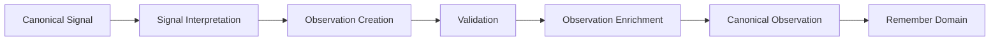

<p align="left">
  
</p>

# OCAS-07 — Domain 01: Observe

| Property | Value |
|----------|-------|
| Document | OCAS-07 |
| Domain | Observe |
| Version | 1.0 |
| Status | Draft |
| Parent | OpsiMind Cognitive Architecture Specification |

---

# 1. Purpose

The **Observe** domain transforms trusted operational **Signals** into
meaningful **Observations**.

Where the Integration domain is responsible for acquiring operational facts,
the Observe domain is responsible for determining **what actually happened**.

Observe is the first domain that introduces operational meaning into the
cognitive architecture.

It answers the cognitive question:

> **"What happened?"**

Observe does not attempt to explain *why* an event occurred or determine the
best course of action. Those responsibilities belong to downstream cognitive
domains.

---

# 2. Mission

The mission of the Observe domain is:

> **Transform canonical operational signals into trusted operational
observations.**

Observations become the authoritative description of operational events and
form the basis for all subsequent knowledge generation.

---

# 3. Cognitive Question

Observe continuously answers:

> **What happened?**

Examples include:

- A service became unavailable.
- API latency increased.
- A deployment completed successfully.
- A Kubernetes Pod restarted.
- Database replication stopped.
- Message queue depth exceeded threshold.
- Disk utilization reached 95%.
- SSL certificate expired.

Observe does **not** answer:

- Why did it happen?
- What is the root cause?
- What should be done?

Those questions belong to Reason and Decide.

---

# 4. Responsibilities

The Observe domain owns the following architectural responsibilities.

## 4.1 Signal Interpretation

Interpret canonical Signals received from Integration.

Interpretation transforms isolated operational facts into meaningful
operational events.

Example:

```
CPU Metric = 97%
```

becomes

```
High CPU Utilization Observed
```

---

## 4.2 Observation Creation

Generate canonical **Observation** objects.

Observations represent trusted descriptions of operational events that have
occurred in the environment.

Every Observation shall be based on one or more validated Signals.

---

## 4.3 Observation Validation

Ensure generated observations are internally consistent.

Validation may include:

- duplicate elimination
- temporal consistency
- completeness checks
- confidence assessment
- rule validation

Only validated observations become canonical information objects.

---

## 4.4 Observation Enrichment

Enrich observations with contextual metadata that is directly observable.

Examples include:

- resource identifiers
- namespaces
- environments
- application names
- deployment identifiers
- regions
- timestamps
- severity

Enrichment shall not infer operational meaning beyond observable facts.

---

## 4.5 Observation Publication

Publish immutable Observation objects.

Published observations become authoritative inputs for the Remember domain.

---

# 5. Inputs

The Observe domain consumes:

| Input | Source |
|--------|--------|
| Signal | Integration |

Signals may represent:

- Metrics
- Logs
- Traces
- Events
- Configuration changes
- Resource states
- Health indicators

Observe treats all Signals uniformly through the canonical information model.

---

# 6. Outputs

The Observe domain publishes one primary canonical information object.

| Information Object | Owner |
|--------------------|-------|
| Observation | Observe |

An Observation represents a trusted description of something that occurred
within the operational environment.

Unlike Signals, Observations contain semantic meaning.

---

# 7. Canonical Information Object

## Observation

An Observation is the first semantically meaningful information object in the
cognitive architecture.

Examples:

- API latency increased
- Database connection failed
- Kubernetes node became unavailable
- Deployment completed
- Certificate expired
- Service recovered

Observations answer only one question:

> **"What happened?"**

They do not attempt to explain causality or recommend actions.

---

# 8. Internal Capability Map

```
                 +----------------------+
                 |      Observe         |
                 +----------------------+
                           |
      +--------------------+--------------------+
      |                    |                    |
Signal Interpretation   Observation Creation  Validation
      |                    |                    |
      +--------------------+--------------------+
                           |
                    Observation Enrichment
                           |
                    Observation Publication
                           |
                      Canonical Observation
```

---

# 9. Information Ownership

Observe is the sole owner of the **Observation** information object.

Only Observe may create or publish canonical Observations.

Downstream domains consume Observations but shall never modify them.

Observations remain immutable after publication.

---

# 10. Domain Boundaries

### Observe Owns

- Signal interpretation
- Observation creation
- Observation validation
- Observation enrichment
- Observation publication

### Observe Does NOT Own

- Resource discovery
- Signal acquisition
- Knowledge creation
- Behavioral modeling
- Root cause analysis
- Decision making
- Execution
- Learning

---

# 11. Domain Invariants

The Observe domain shall always satisfy the following architectural invariants.

## 11.1 Observation Before Understanding

Observe is responsible for identifying **what happened**, not **why it
happened**.

No causal analysis, hypothesis generation, or recommendation shall occur
within this domain.

---

## 11.2 Evidence-Based Observations

Every Observation shall be supported by one or more canonical Signals.

Observations shall never be created without traceable evidence.

```
Signal(s)
     │
     ▼
Observation
```

This guarantees explainability throughout the cognitive lifecycle.

---

## 11.3 Immutable Publication

Once an Observation has been published, it becomes immutable.

Corrections or refinements shall result in the creation of a new Observation
rather than modification of the original.

This preserves:

- Historical accuracy
- Auditability
- Deterministic reasoning

---

## 11.4 Canonical Representation

Every Observation shall conform to the Cognitive Information Model.

Observations are implementation-independent and shall not expose vendor-specific
semantics.

---

## 11.5 Separation from Knowledge

Observe identifies operational events.

Remember determines whether those events become persistent knowledge.

This separation prevents transient operational events from automatically
becoming organizational knowledge.

---

# 12. Quality Attributes

The Observe domain emphasizes the following quality attributes.

## Accuracy

Observations shall faithfully represent operational reality.

---

## Consistency

Equivalent Signals shall produce equivalent Observations.

---

## Timeliness

Observations should be published with minimal delay after Signals are received.

---

## Explainability

Every Observation shall be traceable to the supporting Signal(s).

---

## Reliability

Temporary acquisition inconsistencies shall not compromise the integrity of
published Observations.

---

## Scalability

The Observe domain shall support high-volume event processing while preserving
deterministic behavior.

---

# 13. Domain Interactions

The Observe domain communicates only with adjacent cognitive domains.

## Upstream

**Integration**

Consumes:

- Signal

---

## Downstream

**Remember**

Publishes:

- Observation

```
+------------------+
|   Integration    |
+------------------+
         │
         ▼
      Signal
         │
         ▼
+------------------+
|     Observe      |
+------------------+
         │
         ▼
   Observation
         │
         ▼
+------------------+
|    Remember      |
+------------------+
```

Observe has no direct dependency on Reason, Decide, Execute, Evaluate, or Learn.

---

# 14. Architectural Rationale

Separating **Observation** from **Knowledge** is a deliberate architectural
decision.

Many operational systems immediately treat detected events as knowledge.

OpsiMind distinguishes between the two.

## Events Are Temporary

An event may be important, irrelevant, duplicated, or misleading.

Observe records that an event occurred without judging its long-term
significance.

---

## Knowledge Requires Persistence

Persistent operational knowledge is created only after observations are
evaluated and organized by the Remember domain.

This distinction reduces noise and supports long-term learning.

---

## Explainability

By preserving a dedicated Observation stage, every piece of operational
knowledge can be traced back to observable evidence.

This enables transparent reasoning and auditable recommendations.

---

## Loose Coupling

Reasoning algorithms may evolve without changing how observations are created.

Likewise, observation mechanisms may evolve independently of downstream
cognitive processes.

---

# 15. Future Evolution

Future implementations of the Observe domain may introduce capabilities such as:

- Adaptive observation rules
- Dynamic event classification
- Noise suppression
- Intelligent deduplication
- Confidence scoring
- Streaming observation pipelines
- Edge observation processing
- Multi-source observation fusion

These enhancements extend implementation capabilities without changing the
architectural responsibility of the Observe domain.

---

# 16. Mermaid Diagram



---

# 17. References

This chapter should be read together with:

- OCAS-03 — Canonical Cognitive Architecture
- OCAS-04 — Cognitive Processing Model
- OCAS-05 — Cognitive Information Model
- OCAS-06 — Integration
- OCAS-08 — Remember

---

# 18. Summary

The Observe domain is the first cognitive stage that introduces semantic
meaning into the OpsiMind architecture.

Its responsibility is to transform trusted operational Signals into trusted
Observations that describe **what happened**, while deliberately avoiding any
attempt to explain **why** it happened.

By separating observation from knowledge creation, the architecture preserves
clarity of responsibility, supports explainability, and establishes a stable
foundation for reasoning, decision making, and continuous learning.