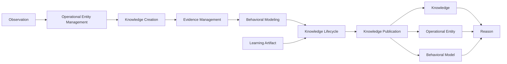

<p align="left">
  
</p>

# OCAS-08 — Domain 02: Remember

| Property | Value |
|----------|-------|
| Document | OCAS-08 |
| Domain | Remember |
| Version | 1.0 |
| Status | Draft |
| Parent | OpsiMind Cognitive Architecture Specification |

---

# 1. Purpose

The **Remember** domain transforms trusted operational **Observations**
into persistent **Operational Knowledge**.

Where the Observe domain answers:

> **"What happened?"**

Remember answers:

> **"What do we know?"**

Remember is responsible for maintaining the long-term operational memory of
OpsiMind.

It creates a durable, explainable, and continuously evolving representation of
operational reality that becomes the foundation for reasoning, decision making,
and learning.

Remember is the authoritative owner of all operational knowledge within the
cognitive architecture.

---

# 2. Mission

The mission of the Remember domain is:

> **Transform trusted operational observations into persistent, explainable,
versioned operational knowledge.**

Unlike transient telemetry, knowledge persists beyond the lifetime of an
individual event.

Knowledge becomes an organizational asset that accumulates over time.

---

# 3. Cognitive Question

The Remember domain continuously answers:

> **"What do we know?"**

Examples include:

- Service A normally responds within 30 ms.
- Database B depends on Cluster C.
- API Gateway owns these routes.
- Payment Service communicates with Fraud Service.
- This workload usually consumes 2 CPUs.
- Service X has failed three times this week.
- Certificate rotation normally occurs every 90 days.
- Deployment Y introduced repeated latency regressions.

These statements are no longer isolated observations.

They represent operational knowledge.

---

# 4. Responsibilities

The Remember domain owns the following architectural responsibilities.

## 4.1 Operational Entity Management

Maintain canonical representations of operational entities.

Examples include:

- Applications
- Services
- APIs
- Databases
- Kubernetes Objects
- Virtual Machines
- Clusters
- Cloud Resources
- Business Services
- External Systems

Operational entities provide the context within which knowledge is organized.

---

## 4.2 Knowledge Creation

Transform validated Observations into durable Knowledge objects.

Knowledge may describe:

- Relationships
- Dependencies
- Normal behavior
- Historical patterns
- Operational characteristics
- Ownership
- Resource topology
- Behavioral expectations

Knowledge creation is evidence-driven and traceable.

---

## 4.3 Evidence Management

Every Knowledge object shall reference the evidence supporting its existence.

Evidence may include:

- Observations
- Historical observations
- Signals
- Evaluation results
- Learning artifacts

Knowledge without evidence shall not exist within the architecture.

---

## 4.4 Behavioral Modeling

Maintain behavioral descriptions of operational entities.

Examples:

- Expected latency
- Normal resource utilization
- Deployment frequency
- Error characteristics
- Seasonal behavior
- Communication patterns

Behavioral models describe normal operational expectations rather than
predictive outcomes.

---

## 4.5 Knowledge Lifecycle Management

Manage the lifecycle of operational knowledge.

Lifecycle activities include:

- Creation
- Versioning
- Evolution
- Retirement
- Archival

Knowledge shall evolve without destroying historical traceability.

---

## 4.6 Knowledge Publication

Publish immutable canonical Knowledge objects.

Knowledge becomes the authoritative input for the Reason domain.

---

# 5. Inputs

The Remember domain consumes:

| Input | Source |
|--------|--------|
| Observation | Observe |
| Learning Artifact | Learn |

Observations introduce new operational evidence.

Learning Artifacts refine existing knowledge without rewriting history.

---

# 6. Outputs

Remember publishes the following canonical information objects.

| Information Object | Owner |
|--------------------|-------|
| Knowledge | Remember |
| Operational Entity | Remember |
| Behavioral Model | Remember |

These objects collectively represent the operational memory of OpsiMind.

---

# 7. Canonical Information Objects

## Knowledge

Knowledge represents trusted operational facts that persist beyond individual
events.

Examples include:

- Service ownership
- Stable dependencies
- Historical behavior
- Operational characteristics
- Persistent relationships

Knowledge is versioned and evidence-backed.

---

## Operational Entity

Operational Entities represent identifiable components within the operational
environment.

Examples:

- Service
- API
- Database
- Queue
- Cluster
- Namespace
- Application
- Business Capability

Entities provide the structural foundation for organizing knowledge.

---

## Behavioral Model

Behavioral Models describe expected operational behavior.

Examples include:

- Normal latency distribution
- CPU utilization patterns
- Deployment frequency
- Communication topology
- Resource consumption trends

Behavioral models support downstream reasoning without making decisions.

---

# 8. Internal Capability Map

```
                 +----------------------+
                 |      Remember        |
                 +----------------------+
                           |
      +--------------------+---------------------+
      |                    |                     |
Operational Entity   Knowledge Creation   Evidence Management
      |                    |                     |
      +--------------------+---------------------+
                           |
                  Behavioral Modeling
                           |
                 Knowledge Lifecycle
                           |
                 Knowledge Publication
                           |
        Knowledge / Entity / Behavioral Model
```

---

# 9. Information Ownership

Remember is the authoritative owner of:

- Knowledge
- Operational Entity
- Behavioral Model

No downstream domain may redefine these canonical objects.

Reason consumes Knowledge.

It never owns Knowledge.

---

# 10. Domain Boundaries

## Remember Owns

- Knowledge creation
- Operational memory
- Entity management
- Behavioral modeling
- Knowledge versioning
- Evidence association
- Knowledge publication

## Remember Does NOT Own

- Observation
- Root cause analysis
- Hypothesis generation
- Decision making
- Execution
- Learning strategy
- Action recommendation

---

# 11. Domain Invariants

The Remember domain shall always satisfy the following architectural
invariants.

## 11.1 Knowledge Must Be Evidence-Based

Every Knowledge object shall reference one or more supporting Observations.

Knowledge shall never be created from assumptions, speculation, or model
output alone.

```
Observation(s)
        │
        ▼
   Knowledge
```

This guarantees that every piece of operational knowledge remains
explainable.

---

## 11.2 Knowledge Is Persistent

Knowledge represents durable operational understanding.

Unlike Observations, Knowledge is expected to survive individual operational
events.

Knowledge remains available until it is explicitly superseded, retired, or
archived.

---

## 11.3 Knowledge Is Versioned

Knowledge shall evolve through versioning.

Example:

```
Knowledge v1
      │
Learning
      │
Knowledge v2
```

Historical versions shall remain available for auditability and reasoning.

Knowledge shall never be overwritten in place.

---

## 11.4 Operational Entities Are Stable

Operational Entities represent long-lived architectural concepts.

Examples include:

- Services
- Databases
- APIs
- Queues
- Clusters
- Business Capabilities

Transient operational events shall never create or destroy entities without
explicit lifecycle management.

---

## 11.5 Separation Between Knowledge and Reasoning

Remember stores operational knowledge.

Reason interprets operational knowledge.

Remember shall never:

- infer causes
- generate hypotheses
- prioritize explanations
- produce recommendations

Similarly, Reason shall never become the owner of Knowledge.

This separation is fundamental to the cognitive architecture.

---

# 12. Quality Attributes

The Remember domain emphasizes the following quality attributes.

## Consistency

Knowledge shall present a consistent representation of operational reality.

---

## Explainability

Every Knowledge object shall be traceable to its supporting evidence.

---

## Durability

Knowledge shall survive process restarts, deployments, and implementation
changes.

---

## Evolvability

Knowledge shall evolve through controlled refinement rather than destructive
updates.

---

## Integrity

Relationships between entities, knowledge, and evidence shall remain
internally consistent.

---

## Scalability

The architecture shall support millions of operational entities and knowledge
objects without changing cognitive responsibilities.

---

# 13. Domain Interactions

The Remember domain interacts only with adjacent cognitive domains.

## Upstream

Consumes:

- Observation (Observe)
- Learning Artifact (Learn)

---

## Downstream

Publishes:

- Knowledge
- Operational Entity
- Behavioral Model

Consumed by:

- Reason

```
+------------------+
|     Observe      |
+------------------+
         │
         ▼
    Observation
         │
         ▼
+------------------+
|    Remember      |
+------------------+
         │
         ├──────────────► Knowledge
         ├──────────────► Operational Entity
         └──────────────► Behavioral Model
                              │
                              ▼
                     +------------------+
                     |      Reason      |
                     +------------------+

Learning Artifact
        ▲
        │
+------------------+
|      Learn       |
+------------------+
```

Remember has no direct dependency on Decide, Execute, or Evaluate.

---

# 14. Architectural Rationale

Separating **Remember** from **Reason** is one of the defining architectural
decisions of OpsiMind.

Many AI systems combine storage, reasoning, and inference into a single
component. OpsiMind intentionally separates these concerns.

## Knowledge Is Not Reasoning

Knowledge describes **what is known**.

Reasoning determines **what that knowledge means in a particular context**.

Keeping these responsibilities separate enables reasoning engines to evolve
without changing the underlying knowledge base.

---

## Long-Term Operational Memory

Traditional observability platforms retain telemetry.

OpsiMind retains operational understanding.

As operational experience accumulates, the platform develops an increasingly
rich operational memory that supports explainable reasoning and better
decisions.

---

## Replaceable Reasoning Technologies

Reasoning implementations may change over time:

- Rule engines
- Graph reasoning
- Machine learning
- LLMs
- Multi-agent systems

Because Knowledge is owned independently, these technologies can be replaced
without redefining operational memory.

---

## Foundation for Learning

Learning refines Knowledge rather than replacing it.

This enables continuous improvement while preserving historical context and
auditability.

---

# 15. Future Evolution

Future implementations of the Remember domain may introduce:

- Knowledge graphs
- Semantic ontologies
- Vector-based knowledge retrieval
- Knowledge confidence scoring
- Automated relationship discovery
- Federated knowledge repositories
- Cross-tenant knowledge isolation
- Domain-specific operational ontologies

These enhancements extend implementation capabilities while preserving the
architectural responsibilities defined in this chapter.

---

# 16. Mermaid Diagram



---

# 17. References

This chapter should be read together with:

- OCAS-03 — Canonical Cognitive Architecture
- OCAS-04 — Cognitive Processing Model
- OCAS-05 — Cognitive Information Model
- OCAS-07 — Observe
- OCAS-09 — Reason
- OCAS-13 — Learn

---

# 18. Summary

The Remember domain is the **operational memory** of OpsiMind.

Its responsibility is to transform trusted Observations into durable,
versioned, evidence-backed Knowledge that can be used by downstream cognitive
domains.

By separating **knowledge ownership** from **reasoning**, the architecture
establishes a stable foundation for explainable AI, replaceable reasoning
engines, and continuous organizational learning.

Knowledge is treated as a long-lived enterprise asset rather than a transient
artifact of runtime analysis.

This distinction is one of the key architectural characteristics that
differentiates OpsiMind from traditional observability and AIOps platforms.