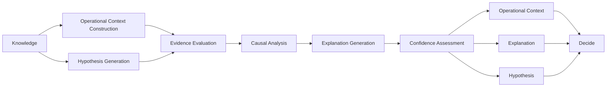

<p align="left">
  
</p>

# OCAS-09 — Domain 03: Reason

| Property | Value |
|----------|-------|
| Document | OCAS-09 |
| Domain | Reason |
| Version | 1.0 |
| Status | Draft |
| Parent | OpsiMind Cognitive Architecture Specification |

---

# 1. Purpose

The **Reason** domain transforms persistent operational **Knowledge** into
contextual understanding.

While the Remember domain answers:

> **"What do we know?"**

the Reason domain answers:

> **"Why is this happening, and what does it mean?"**

Reason is responsible for interpreting operational knowledge, constructing
context, evaluating evidence, generating hypotheses, and producing
explainable operational understanding.

Reason does **not** make decisions.

Its responsibility ends when contextual understanding has been established.

---

# 2. Mission

The mission of the Reason domain is:

> **Transform operational knowledge into explainable operational context through
evidence-driven reasoning.**

Reason provides understanding rather than action.

Its outputs become the primary inputs to the Decide domain.

---

# 3. Cognitive Question

The Reason domain continuously answers:

> **Why is this happening?**

and

> **What does it mean?**

Examples include:

- API latency increased because Database A became saturated.
- Pod restarts are correlated with recent deployments.
- Multiple alerts originate from a single infrastructure failure.
- Service degradation affects payment processing.
- Increased CPU usage is expected because of scheduled batch processing.

Reason focuses on interpretation, not recommendation.

---

# 4. Responsibilities

The Reason domain owns the following architectural responsibilities.

## 4.1 Operational Context Construction

Construct a coherent representation of the current operational state.

Operational Context combines:

- Knowledge
- Behavioral Models
- Operational Entities
- Recent Observations
- Historical Knowledge

into a unified understanding.

---

## 4.2 Hypothesis Generation

Generate candidate explanations for observed operational behavior.

Examples:

- Infrastructure failure
- Resource exhaustion
- Network partition
- Configuration drift
- Software regression
- External dependency failure

Hypotheses are potential explanations—not facts.

---

## 4.3 Evidence Evaluation

Evaluate available evidence supporting each hypothesis.

Evidence may include:

- Observations
- Historical Knowledge
- Behavioral Models
- Topology
- Dependencies
- Previous incidents
- Learning Artifacts

Reason shall explicitly associate evidence with every hypothesis.

---

## 4.4 Causal Analysis

Determine relationships between operational events.

Examples:

- Dependency chains
- Failure propagation
- Cascading failures
- Root contributing factors
- Shared infrastructure

Reason produces causal understanding rather than simple event correlation.

---

## 4.5 Explanation Generation

Produce human-readable operational explanations.

Examples:

> Payment failures originate from database connection exhaustion.

> Increased API latency is consistent with resource contention introduced
during the latest deployment.

Every explanation shall reference supporting evidence.

---

## 4.6 Confidence Assessment

Assign confidence to generated explanations.

Confidence may be derived from:

- Evidence quality
- Historical consistency
- Behavioral similarity
- Knowledge completeness
- Model certainty

Confidence supports downstream decision making but does not replace human
judgment.

---

## 4.7 Publication

Publish canonical Reason outputs.

Published information becomes immutable and serves as input to the Decide
domain.

---

# 5. Inputs

The Reason domain consumes:

| Input | Source |
|--------|--------|
| Knowledge | Remember |
| Operational Entity | Remember |
| Behavioral Model | Remember |
| Observation (optional contextual input) | Observe |

Reason does not consume raw Signals.

It reasons only over interpreted operational knowledge.

---

# 6. Outputs

Reason publishes the following canonical information objects.

| Information Object | Owner |
|--------------------|-------|
| Operational Context | Reason |
| Explanation | Reason |
| Hypothesis | Reason |

These objects collectively describe the interpreted operational state.

---

# 7. Canonical Information Objects

## Operational Context

Operational Context represents the current understanding of the operational
environment.

Context combines multiple sources of knowledge into a coherent picture of the
system state.

---

## Hypothesis

A Hypothesis represents a candidate explanation for observed behavior.

Hypotheses may later be:

- Supported
- Rejected
- Refined

A Hypothesis is not itself Knowledge.

---

## Explanation

An Explanation describes why Reason believes a particular operational state
exists.

Every Explanation shall reference:

- Evidence
- Supporting Knowledge
- Confidence
- Related Hypotheses

---

# 8. Internal Capability Map

```
                    +----------------------+
                    |       Reason         |
                    +----------------------+
                               |
        +----------------------+----------------------+
        |                      |                      |
 Operational Context     Hypothesis           Evidence
 Construction            Generation          Evaluation
        |                      |                      |
        +----------------------+----------------------+
                               |
                      Causal Analysis
                               |
                      Explanation Generation
                               |
                      Confidence Assessment
                               |
                         Publication
                               |
      Operational Context / Explanation / Hypothesis
```

---

# 9. Information Ownership

Reason is the sole owner of:

- Operational Context
- Explanation
- Hypothesis

Reason consumes Knowledge but never modifies or republishes it.

Knowledge ownership remains exclusively within the Remember domain.

---

# 10. Domain Boundaries

## Reason Owns

- Context construction
- Hypothesis generation
- Evidence evaluation
- Causal analysis
- Explanation generation
- Confidence assessment
- Publication

## Reason Does NOT Own

- Knowledge creation
- Knowledge persistence
- Decision making
- Action recommendation
- Execution
- Learning

---

# 11. Domain Invariants

The Reason domain shall always satisfy the following architectural invariants.

## 11.1 Reasoning Shall Be Evidence-Driven

Every Explanation and Hypothesis shall reference supporting evidence.

Reasoning shall never produce conclusions without traceable supporting
information.

```
Knowledge
      │
Evidence
      │
      ▼
Explanation
```

Evidence is a mandatory architectural requirement rather than an optional
implementation feature.

---

## 11.2 Knowledge Shall Not Be Modified

Reason consumes operational Knowledge.

Reason shall never:

- modify Knowledge
- delete Knowledge
- create Knowledge
- redefine Knowledge

Knowledge ownership remains exclusively within the Remember domain.

---

## 11.3 Hypotheses Are Not Facts

Hypotheses represent possible explanations.

They become useful reasoning artifacts but never replace canonical
Knowledge.

A Hypothesis may later become:

- Supported
- Refuted
- Refined

without affecting existing Knowledge.

---

## 11.4 Explainability Is Mandatory

Every Explanation shall identify:

- supporting Knowledge
- supporting Observations
- supporting Evidence
- confidence level
- reasoning path

This enables complete end-to-end explainability.

---

## 11.5 Technology Independence

The architectural responsibility of Reason shall remain independent of any
specific reasoning technology.

Examples include:

- Rule Engines
- Bayesian Networks
- Knowledge Graphs
- Graph Neural Networks
- Machine Learning
- LLMs
- Multi-Agent Systems
- Future AI technologies

These technologies implement reasoning.

They are not the architecture.

---

# 12. Quality Attributes

The Reason domain emphasizes the following quality attributes.

## Explainability

Every operational conclusion shall be understandable by humans.

---

## Traceability

Every reasoning outcome shall be traceable back to supporting Knowledge and
Evidence.

---

## Consistency

Equivalent operational contexts should produce equivalent reasoning outcomes.

---

## Confidence

Reason shall explicitly communicate uncertainty rather than implying
absolute certainty.

---

## Extensibility

New reasoning techniques should be introduced without changing domain
responsibilities.

---

## Scalability

Reason shall support increasingly large operational knowledge bases while
preserving architectural behavior.

---

# 13. Domain Interactions

The Reason domain communicates only with adjacent cognitive domains.

## Upstream

Consumes:

- Knowledge
- Operational Entity
- Behavioral Model

Published by:

- Remember

---

## Downstream

Publishes:

- Operational Context
- Explanation
- Hypothesis

Consumed by:

- Decide

```
+------------------+
|    Remember      |
+------------------+
         │
         ▼
Knowledge / Entity / Behavioral Model
         │
         ▼
+------------------+
|      Reason      |
+------------------+
         │
         ├────────────► Operational Context
         ├────────────► Explanation
         └────────────► Hypothesis
                         │
                         ▼
                 +------------------+
                 |      Decide      |
                 +------------------+
```

Reason has no direct dependency on Execute, Evaluate, or Learn.

---

# 14. Architectural Rationale

Separating **Reason** from **Decide** is one of the defining principles of
the OpsiMind cognitive architecture.

Many AI systems immediately convert reasoning into actions.

OpsiMind intentionally introduces a distinct decision stage.

## Understanding Is Not Decision Making

Reason determines:

> What is happening?

Decide determines:

> What should be done?

Keeping these responsibilities separate enables:

- human review
- policy enforcement
- risk evaluation
- governance
- explainable automation

---

## AI Independence

Reason is deliberately independent of implementation technologies.

A deployment may use:

- deterministic rules
- statistical reasoning
- causal inference
- machine learning
- graph reasoning
- LLMs
- agentic reasoning

without changing the architecture.

---

## Stable Operational Understanding

Operational Context becomes a reusable enterprise asset.

Multiple downstream consumers may rely on the same contextual understanding
without repeating reasoning.

---

## Explainable AI

Modern AI systems often produce opaque conclusions.

The Reason domain requires every Explanation to be evidence-backed and
traceable, ensuring that recommendations can always be justified.

---

# 15. Future Evolution

Future implementations of the Reason domain may introduce:

- Causal AI
- Probabilistic reasoning
- Temporal reasoning
- Knowledge graph inference
- Multi-agent collaboration
- Counterfactual reasoning
- Simulation-assisted reasoning
- Self-improving reasoning strategies

These capabilities enhance implementation while preserving the architectural
responsibility of the Reason domain.

---

# 16. Mermaid Diagram



---

# 17. References

This chapter should be read together with:

- OCAS-03 — Canonical Cognitive Architecture
- OCAS-04 — Cognitive Processing Model
- OCAS-05 — Cognitive Information Model
- OCAS-08 — Remember
- OCAS-10 — Decide

---

# 18. Summary

The Reason domain is the cognitive interpretation engine of OpsiMind.

Its responsibility is to transform persistent operational Knowledge into
contextual understanding through evidence-driven reasoning.

By separating **Knowledge**, **Reasoning**, and **Decision Making**, the
architecture establishes a clear cognitive pipeline that is explainable,
technology-independent, and capable of evolving with future AI advances.

Reason produces understanding—not actions.

That distinction is fundamental to the long-term architecture of OpsiMind.