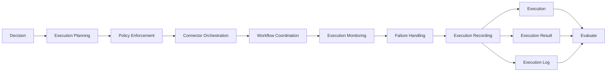

<p align="left">
  
</p>

# OCAS-11 — Domain 05: Execute

| Property | Value |
|----------|-------|
| Document | OCAS-11 |
| Domain | Execute |
| Version | 1.0 |
| Status | Draft |
| Parent | OpsiMind Cognitive Architecture Specification |

---

# 1. Purpose

The **Execute** domain transforms approved operational **Decisions** into
controlled interactions with operational environments.

While the Decide domain answers:

> **"What should be done?"**

the Execute domain answers:

> **"How do we safely carry it out?"**

Execute is responsible for orchestrating, coordinating, monitoring, and
recording operational actions while ensuring they conform to governance,
security, and execution policies.

Execute does not determine whether an action should occur. It is responsible
only for carrying out approved intent.

---

# 2. Mission

The mission of the Execute domain is:

> **Perform approved operational actions in a safe, observable, reliable, and
governed manner while preserving complete execution traceability.**

Execution bridges cognitive intent and operational reality.

---

# 3. Cognitive Question

The Execute domain continuously answers:

> **"How do we perform the selected action safely and correctly?"**

Examples include:

- Restart the affected Kubernetes Deployment.
- Scale a workload from 5 to 10 replicas.
- Roll back a failed deployment.
- Rotate an expired certificate.
- Create a cloud snapshot.
- Trigger an automation workflow.
- Notify an external incident management platform.
- Pause execution because required approval is missing.

Execution focuses on implementation rather than decision making.

---

# 4. Responsibilities

The Execute domain owns the following architectural responsibilities.

## 4.1 Execution Planning

Transform a Decision into an executable operational plan.

Planning activities may include:

- Target resolution
- Dependency ordering
- Sequencing
- Preconditions
- Resource validation
- Execution strategy selection

The execution plan shall remain consistent with the originating Decision.

---

## 4.2 Connector Orchestration

Coordinate execution across operational systems through Integration
connectors.

Examples include:

- Kubernetes
- Cloud providers
- Service meshes
- CI/CD platforms
- Monitoring systems
- ITSM platforms
- Security platforms
- Custom enterprise systems

Execute invokes capabilities exposed through Integration rather than
communicating directly with vendor-specific technologies.

---

## 4.3 Policy Enforcement

Validate execution-time constraints before performing actions.

Examples include:

- Approval status
- Maintenance windows
- Security policies
- Rate limits
- Resource quotas
- Change freezes
- Environmental restrictions

Execution shall not proceed when mandatory constraints are violated.

---

## 4.4 Workflow Coordination

Coordinate multi-step operational procedures.

Examples include:

- Rolling restart
- Blue/green deployment
- Canary rollout
- Multi-region failover
- Database recovery
- Incident response workflow

Workflow coordination ensures consistency across complex operations.

---

## 4.5 Execution Monitoring

Observe the progress of running actions.

Monitor:

- Current state
- Step completion
- Intermediate failures
- Timeouts
- Retries
- External responses

Execution progress shall remain observable throughout the action lifecycle.

---

## 4.6 Failure Handling

Manage execution failures through controlled recovery mechanisms.

Recovery strategies may include:

- Retry
- Rollback
- Compensation
- Escalation
- Abort
- Partial completion reporting

Failure handling is part of execution rather than evaluation.

---

## 4.7 Execution Recording

Record all execution activities.

Execution records shall include:

- Executed actions
- Timestamps
- Target systems
- Operator identity (when applicable)
- Automation identity
- Status
- Results
- Errors

Execution history supports governance, auditing, and future learning.

---

## 4.8 Publication

Publish immutable execution outcomes.

Execution outcomes become the primary input for the Evaluate domain.

---

# 5. Inputs

The Execute domain consumes:

| Input | Source |
|--------|--------|
| Decision | Decide |
| Candidate Action (optional) | Decide |
| Decision Rationale (reference) | Decide |

Execution consumes approved Decisions only.

Unapproved Decisions shall not be executed.

---

# 6. Outputs

The Execute domain publishes the following canonical information objects.

| Information Object | Owner |
|--------------------|-------|
| Execution | Execute |
| Execution Result | Execute |
| Execution Log | Execute |

These objects collectively describe what was performed and what occurred
during execution.

---

# 7. Canonical Information Objects

## Execution

An Execution represents a concrete realization of a Decision.

Typical attributes include:

- Execution identifier
- Referenced Decision
- Target
- Start time
- End time
- Status
- Actor
- Execution strategy

---

## Execution Result

Execution Result summarizes the outcome of an Execution.

Possible outcomes include:

- Successful
- Failed
- Cancelled
- Timed Out
- Partially Successful

Execution Result records what happened without judging whether the outcome
was desirable.

---

## Execution Log

Execution Logs provide a chronological record of execution events.

Typical entries include:

- Step started
- Step completed
- Retry initiated
- Validation failed
- Rollback performed
- External response received

Execution Logs provide operational traceability.

---

# 8. Internal Capability Map

```
                    +----------------------+
                    |      Execute         |
                    +----------------------+
                               |
      +------------------------+------------------------+
      |                        |                        |
Execution Planning     Connector Orchestration   Policy Enforcement
      |                        |                        |
      +------------------------+------------------------+
                               |
                     Workflow Coordination
                               |
                      Execution Monitoring
                               |
                      Failure Handling
                               |
                      Execution Recording
                               |
                         Publication
                               |
        Execution / Execution Result / Execution Log
```

---

# 9. Information Ownership

Execute is the authoritative owner of:

- Execution
- Execution Result
- Execution Log

Execute consumes Decisions but does not modify, replace, or reinterpret them.

Ownership of Decision remains exclusively within the Decide domain.

---

# 10. Domain Boundaries

## Execute Owns

- Execution planning
- Workflow coordination
- Connector orchestration
- Policy enforcement during execution
- Failure handling
- Execution monitoring
- Execution recording
- Publication of execution outcomes

## Execute Does NOT Own

- Decision selection
- Operational reasoning
- Knowledge management
- Outcome evaluation
- Organizational learning
- Strategic optimization

---

# 11. Domain Invariants

The Execute domain shall always satisfy the following architectural
invariants.

## 11.1 Every Execution Shall Reference a Decision

Every Execution shall reference exactly one approved Decision.

Execution shall never originate independently of the Decide domain.

```
Decision
    │
    ▼
Execution
```

This preserves traceability from operational action back to cognitive intent.

---

## 11.2 Execution Shall Not Modify Decisions

Execute realizes Decisions.

It shall never:

- create Decisions
- modify Decisions
- replace Decisions
- reinterpret Decisions

Decision ownership remains exclusively within the Decide domain.

---

## 11.3 Policy Validation Is Mandatory

Before execution begins, all mandatory execution constraints shall be
validated.

Examples include:

- Required approvals
- Maintenance windows
- Environmental restrictions
- Security policies
- Resource availability

Execution shall not proceed if mandatory constraints are not satisfied.

---

## 11.4 Execution Shall Be Observable

Every significant execution event shall be recorded.

Examples include:

- Start
- Completion
- Retry
- Rollback
- Failure
- Cancellation
- Timeout

Execution shall never occur as an opaque process.

---

## 11.5 Failure Shall Be Explicit

Execution failures shall be represented as first-class outcomes.

Failures shall never be silently ignored or hidden.

Execution records shall clearly identify:

- Failure type
- Failure location
- Recovery attempts
- Final outcome

---

# 12. Quality Attributes

The Execute domain emphasizes the following quality attributes.

## Reliability

Execution shall behave predictably under normal and failure conditions.

---

## Safety

Execution shall respect governance policies and avoid unauthorized changes.

---

## Traceability

Every action shall be traceable to the originating Decision.

---

## Observability

Execution progress and results shall remain visible throughout the execution
lifecycle.

---

## Recoverability

The architecture shall support retries, rollbacks, and compensating actions
when appropriate.

---

## Scalability

The execution engine shall coordinate large numbers of concurrent operational
actions across distributed environments.

---

# 13. Domain Interactions

The Execute domain communicates only with adjacent cognitive domains and the
Integration domain for external interactions.

## Upstream

Consumes:

- Decision
- Candidate Action (reference)
- Decision Rationale (reference)

Published by:

- Decide

---

## Downstream

Publishes:

- Execution
- Execution Result
- Execution Log

Consumed by:

- Evaluate

---

## External Interaction

Execute performs operational actions through capabilities exposed by the
Integration domain.

```
                +------------------+
                |      Decide      |
                +------------------+
                         │
                         ▼
                    Decision
                         │
                         ▼
                +------------------+
                |     Execute      |
                +------------------+
                    │          │
                    │          ▼
                    │   Execution Result
                    │
                    ▼
             Integration Domain
                    │
                    ▼
          External Operational Systems
                    │
                    ▼
                +------------------+
                |     Evaluate     |
                +------------------+
```

Execute does not communicate directly with vendor-specific systems. It relies
on Integration to provide standardized operational capabilities.

---

# 14. Architectural Rationale

Separating **Execution** from **Evaluation** ensures that performing an
action and judging its effectiveness remain distinct responsibilities.

Many automation platforms stop once an action has completed successfully.
OpsiMind treats successful execution and successful outcomes as different
concepts.

## Execution Is Not Success

An action may execute correctly while failing to achieve its intended goal.

Example:

- Deployment rollback completed successfully.
- Customer-facing latency remains elevated.

Execution succeeded.

Operational objective did not.

Evaluation determines whether the objective was achieved.

---

## Controlled Interaction with the External World

External environments are inherently unpredictable.

The Execute domain encapsulates:

- orchestration
- retries
- compensation
- rollback
- timeout handling
- coordination

This isolates operational uncertainty from the cognitive domains.

---

## Integration as the Operational Boundary

Execute does not implement vendor-specific APIs.

Instead, it invokes standardized capabilities exposed by the Integration
domain.

This preserves:

- portability
- extensibility
- implementation independence

---

## Complete Operational Traceability

Every operational change can be traced through the cognitive pipeline:

```
Knowledge
      ↓
Reason
      ↓
Decision
      ↓
Execution
```

This enables governance, auditing, compliance, and post-incident analysis.

---

# 15. Future Evolution

Future implementations of the Execute domain may introduce:

- Distributed workflow engines
- Event-driven execution orchestration
- Adaptive retry strategies
- Intelligent rollback planning
- Progressive delivery orchestration
- Cross-cloud execution
- Agent-assisted workflow execution
- Autonomous remediation pipelines

These capabilities enhance execution sophistication while preserving the
architectural responsibility of the Execute domain.

---

# 16. Mermaid Diagram



---

# 17. References

This chapter should be read together with:

- OCAS-04 — Cognitive Processing Model
- OCAS-05 — Cognitive Information Model
- OCAS-06 — Integration
- OCAS-10 — Decide
- OCAS-12 — Evaluate

---

# 18. Summary

The Execute domain is the operational realization engine of OpsiMind.

Its responsibility is to transform approved Decisions into safe, governed,
observable operational actions while preserving complete execution
traceability.

By separating **decision making**, **execution**, and **evaluation**, the
architecture ensures that actions are not only performed correctly but can
also be assessed independently for effectiveness.

Execution answers the question **"Was the action carried out?"**. Determining
whether that action achieved the intended operational objective is the
responsibility of the Evaluate domain.