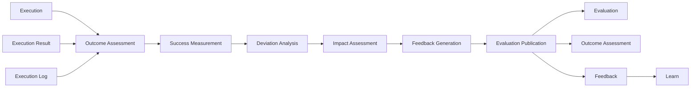

<p align="left">
  
</p>

# OCAS-12 — Domain 06: Evaluate

| Property | Value |
|----------|-------|
| Document | OCAS-12 |
| Domain | Evaluate |
| Version | 1.0 |
| Status | Draft |
| Parent | OpsiMind Cognitive Architecture Specification |

---

# 1. Purpose

The **Evaluate** domain determines whether executed operational actions
achieved their intended objectives.

While the Execute domain answers:

> **"Was the action carried out?"**

the Evaluate domain answers:

> **"Did the action produce the desired outcome?"**

Evaluation compares expected outcomes with observed operational reality,
identifies deviations, measures effectiveness, and produces feedback for
continuous improvement.

Evaluate does not perform new actions.

Its responsibility is to assess completed actions objectively.

---

# 2. Mission

The mission of the Evaluate domain is:

> **Assess the effectiveness of executed operational actions through objective,
evidence-based comparison of intended and actual outcomes.**

Evaluation transforms execution history into operational insight.

---

# 3. Cognitive Question

The Evaluate domain continuously answers:

> **"Did we accomplish what we intended?"**

Examples include:

- Service availability returned to normal.
- Latency remained unchanged after scaling.
- Rollback restored application stability.
- Error rate decreased but remained above target.
- Recovery took longer than expected.
- Automation completed successfully but violated the recovery objective.
- Human intervention improved overall outcome.
- The selected remediation had no measurable effect.

Evaluation focuses on outcomes rather than execution correctness.

---

# 4. Responsibilities

The Evaluate domain owns the following architectural responsibilities.

## 4.1 Outcome Assessment

Compare expected operational objectives with actual results.

Assessment considers:

- Decision intent
- Execution Result
- Current operational state
- Post-execution observations

Outcome assessment determines whether objectives were achieved.

---

## 4.2 Success Measurement

Measure the effectiveness of completed actions.

Examples include:

- Recovery success
- Availability improvement
- Latency reduction
- Error reduction
- Cost impact
- Resource efficiency
- Customer experience improvement

Success may be partial rather than binary.

---

## 4.3 Deviation Analysis

Identify differences between expected and observed outcomes.

Examples include:

- Objective achieved later than expected
- Recovery incomplete
- Unexpected side effects
- New operational issues introduced
- Business objectives unmet

Deviation analysis supports future learning.

---

## 4.4 Impact Assessment

Determine the operational consequences of executed actions.

Impact dimensions include:

- Technical impact
- Business impact
- Customer impact
- Financial impact
- Security impact
- Compliance impact

Impact assessment extends beyond simple execution status.

---

## 4.5 Feedback Generation

Produce structured feedback describing evaluation results.

Feedback includes:

- Success level
- Observed deviations
- Outcome quality
- Supporting evidence
- Recommended learning inputs

Feedback becomes an input to the Learn domain.

---

## 4.6 Evaluation Publication

Publish immutable evaluation artifacts.

Published evaluations become part of the operational history of the platform.

---

# 5. Inputs

The Evaluate domain consumes:

| Input | Source |
|--------|--------|
| Execution | Execute |
| Execution Result | Execute |
| Execution Log | Execute |
| Decision (reference) | Decide |
| Operational Context (reference) | Reason |

Evaluation may also consume newly generated Observations to verify the
post-execution operational state.

---

# 6. Outputs

The Evaluate domain publishes the following canonical information objects.

| Information Object | Owner |
|--------------------|-------|
| Evaluation | Evaluate |
| Outcome Assessment | Evaluate |
| Feedback | Evaluate |

These objects collectively describe how successful an executed action was.

---

# 7. Canonical Information Objects

## Evaluation

An Evaluation represents the formal assessment of an executed Decision.

Typical attributes include:

- Evaluation identifier
- Referenced Execution
- Referenced Decision
- Overall assessment
- Success level
- Confidence
- Timestamp

---

## Outcome Assessment

Outcome Assessment compares expected objectives with actual operational
results.

Typical outcomes include:

- Fully achieved
- Partially achieved
- Not achieved
- Inconclusive

Outcome Assessment provides objective measurement independent of execution
status.

---

## Feedback

Feedback captures structured information intended for continuous improvement.

Typical contents include:

- Observed deviations
- Success metrics
- Supporting evidence
- Lessons identified
- Recommendations for learning

Feedback does not directly modify knowledge or policies.

---

# 8. Internal Capability Map

```
                    +----------------------+
                    |      Evaluate        |
                    +----------------------+
                               |
      +------------------------+------------------------+
      |                        |                        |
 Outcome Assessment     Success Measurement   Deviation Analysis
      |                        |                        |
      +------------------------+------------------------+
                               |
                      Impact Assessment
                               |
                      Feedback Generation
                               |
                    Evaluation Publication
                               |
         Evaluation / Outcome Assessment / Feedback
```

---

# 9. Information Ownership

Evaluate is the authoritative owner of:

- Evaluation
- Outcome Assessment
- Feedback

Evaluation consumes Decisions and Executions but does not modify them.

Ownership of those information objects remains with their originating domains.

---

# 10. Domain Boundaries

## Evaluate Owns

- Outcome assessment
- Success measurement
- Deviation analysis
- Impact assessment
- Feedback generation
- Evaluation publication

## Evaluate Does NOT Own

- Decision making
- Action execution
- Knowledge creation
- Organizational learning
- Operational reasoning

---

# 11. Domain Invariants

The Evaluate domain shall always satisfy the following architectural
invariants.

## 11.1 Every Evaluation Shall Reference an Execution

Every Evaluation shall reference one completed Execution.

Evaluation shall never occur independently of execution.

```
Decision
    │
    ▼
Execution
    │
    ▼
Evaluation
```

This preserves complete traceability from intent to outcome.

---

## 11.2 Evaluation Shall Be Outcome-Oriented

Evaluation measures operational outcomes rather than execution correctness.

An execution may be technically successful while operationally unsuccessful.

Examples:

- Deployment completed successfully.
- Service remains unavailable.

Execution succeeded.

Operational objective failed.

Evaluation shall distinguish between these concepts.

---

## 11.3 Evaluation Shall Be Evidence-Based

Every Outcome Assessment shall reference objective evidence.

Evidence may include:

- Execution Results
- Execution Logs
- Post-execution Observations
- Operational metrics
- Business indicators

Subjective conclusions shall not be published as canonical Evaluations.

---

## 11.4 Evaluation Shall Not Initiate Actions

Evaluate assesses completed actions.

It shall never:

- execute new actions
- modify Decisions
- create Knowledge
- trigger remediation directly

Subsequent actions require a new cognitive cycle beginning with updated
observations and reasoning.

---

## 11.5 Feedback Shall Be Immutable

Published Feedback represents historical operational experience.

Corrections or refinements shall create new Feedback artifacts rather than
modifying existing ones.

This preserves auditability and enables longitudinal analysis.

---

# 12. Quality Attributes

The Evaluate domain emphasizes the following quality attributes.

## Objectivity

Outcome assessments shall be based on measurable evidence.

---

## Traceability

Every Evaluation shall be traceable to:

- Decision
- Execution
- Supporting evidence

---

## Accuracy

Outcome measurements shall faithfully represent observed operational reality.

---

## Consistency

Equivalent operational outcomes should produce equivalent evaluations.

---

## Auditability

Historical evaluations shall remain available for compliance, governance,
and post-incident review.

---

## Scalability

The evaluation framework shall support continuous assessment across large
numbers of concurrent operational activities.

---

# 13. Domain Interactions

The Evaluate domain communicates with the Execute and Learn domains.

## Upstream

Consumes:

- Execution
- Execution Result
- Execution Log

Published by:

- Execute

May reference:

- Decision
- Operational Context

---

## Downstream

Publishes:

- Evaluation
- Outcome Assessment
- Feedback

Consumed by:

- Learn

```
+------------------+
|     Execute      |
+------------------+
         │
         ▼
Execution / Result / Log
         │
         ▼
+------------------+
|     Evaluate     |
+------------------+
         │
         ├────────────► Evaluation
         ├────────────► Outcome Assessment
         └────────────► Feedback
                         │
                         ▼
                 +------------------+
                 |      Learn       |
                 +------------------+
```

Evaluate does not communicate directly with Remember.

Knowledge refinement is mediated through the Learn domain.

---

# 14. Architectural Rationale

Separating **Evaluation** from **Learning** is a deliberate architectural
choice.

Evaluation determines whether a specific operational objective was achieved.

Learning determines how the organization should improve future behavior.

## Assessment Is Not Adaptation

Evaluation answers:

> Did this work?

Learning answers:

> What should change because of this?

Keeping these responsibilities separate prevents isolated operational events
from immediately altering organizational knowledge or policies.

---

## Objective Feedback

Evaluation produces standardized, evidence-based Feedback regardless of
whether the original action was initiated by:

- Human operators
- Rule engines
- AI agents
- Autonomous workflows

This creates a consistent foundation for organizational learning.

---

## Independent Improvement

Evaluation methods may evolve independently of learning strategies.

For example:

- New business KPIs
- Customer experience metrics
- Sustainability objectives
- Regulatory compliance criteria

can be incorporated without changing how learning occurs.

---

## Closing the Operational Loop

Evaluation completes the operational cycle by connecting actions to measured
outcomes.

Without evaluation, automation becomes activity-driven rather than
outcome-driven.

---

# 15. Future Evolution

Future implementations of the Evaluate domain may introduce:

- Business KPI evaluation
- Customer experience scoring
- Cost-benefit analysis
- Sustainability impact assessment
- Policy effectiveness measurement
- Digital twin outcome validation
- Simulation-based evaluation
- Adaptive success metrics

These capabilities enhance evaluation sophistication while preserving the
architectural responsibility of the Evaluate domain.

---

# 16. Mermaid Diagram



---

# 17. References

This chapter should be read together with:

- OCAS-04 — Cognitive Processing Model
- OCAS-05 — Cognitive Information Model
- OCAS-11 — Execute
- OCAS-13 — Learn

---

# 18. Summary

The Evaluate domain is the outcome assessment engine of OpsiMind.

Its responsibility is to determine whether executed Decisions achieved their
intended operational objectives through objective, evidence-based assessment.

By separating **execution**, **evaluation**, and **learning**, the
architecture ensures that operational actions are assessed consistently before
they influence future organizational behavior.

Evaluation answers **"Did we achieve the intended result?"**

The responsibility for determining **how future behavior should change** is
delegated to the Learn domain, completing the cognitive feedback cycle.