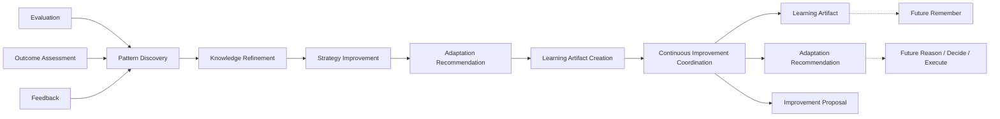

<p align="left">
  
</p>

# OCAS-13 — Domain 07: Learn

| Property | Value |
|----------|-------|
| Document | OCAS-13 |
| Domain | Learn |
| Version | 1.0 |
| Status | Draft |
| Parent | OpsiMind Cognitive Architecture Specification |

---

# 1. Purpose

The **Learn** domain transforms accumulated operational **Feedback** into
improvements that enhance future cognitive cycles.

While the Evaluate domain answers:

> **"Did we achieve the intended result?"**

the Learn domain answers:

> **"What should change so we perform better next time?"**

Learn continuously refines operational knowledge, behavioral models,
reasoning strategies, decision policies, and execution approaches based on
validated operational experience.

Learning changes future behavior rather than reinterpreting past events.

---

# 2. Mission

The mission of the Learn domain is:

> **Continuously improve the cognitive capabilities of OpsiMind through
evidence-based adaptation while preserving explainability, governance, and
historical traceability.**

Learning transforms operational experience into organizational capability.

---

# 3. Cognitive Question

The Learn domain continuously answers:

> **"How should we improve?"**

Examples include:

- Update the normal latency baseline.
- Increase confidence in a recurring failure pattern.
- Refine a dependency relationship.
- Improve remediation policy selection.
- Adjust execution retry strategy.
- Recommend human approval for similar future incidents.
- Identify obsolete operational knowledge.
- Detect opportunities for automation.

Learning focuses on improving future cognitive performance.

---

# 4. Responsibilities

The Learn domain owns the following architectural responsibilities.

## 4.1 Pattern Discovery

Identify recurring operational patterns from accumulated evaluations.

Examples include:

- Frequent incident sequences
- Repeating deployment failures
- Seasonal workload changes
- Persistent dependency issues
- Successful remediation strategies

Discovered patterns become candidates for organizational improvement.

---

## 4.2 Knowledge Refinement

Recommend improvements to operational Knowledge.

Examples include:

- New relationships
- Updated behavioral models
- Refined operational characteristics
- Confidence adjustments
- Retirement of obsolete knowledge

Knowledge refinement shall preserve version history.

---

## 4.3 Strategy Improvement

Identify opportunities to improve cognitive strategies.

Examples include:

- Reasoning strategies
- Decision policies
- Risk models
- Evaluation criteria
- Execution workflows

Strategy improvements describe recommendations rather than immediate
changes.

---

## 4.4 Adaptation Recommendation

Produce explicit recommendations describing proposed improvements.

Recommendations may target:

- Knowledge
- Policies
- Behavioral Models
- Objectives
- Governance rules
- Automation strategies

Adaptation recommendations shall be explainable and evidence-backed.

---

## 4.5 Learning Artifact Creation

Create canonical Learning Artifacts that summarize validated operational
experience.

Learning Artifacts become inputs to future Remember and Reason cycles.

---

## 4.6 Continuous Improvement Coordination

Coordinate long-term organizational improvement without disrupting current
operations.

Learning affects future cognition rather than current execution.

---

## 4.7 Publication

Publish immutable Learning Artifacts.

Published artifacts become authoritative inputs for future cognitive cycles.

---

# 5. Inputs

The Learn domain consumes:

| Input | Source |
|--------|--------|
| Evaluation | Evaluate |
| Outcome Assessment | Evaluate |
| Feedback | Evaluate |

Learning may also reference historical Knowledge, Behavioral Models, and
Operational Context to identify long-term trends.

---

# 6. Outputs

The Learn domain publishes the following canonical information objects.

| Information Object | Owner |
|--------------------|-------|
| Learning Artifact | Learn |
| Adaptation Recommendation | Learn |
| Improvement Proposal | Learn |

These objects collectively describe validated opportunities for future
improvement.

---

# 7. Canonical Information Objects

## Learning Artifact

A Learning Artifact captures validated operational experience that should
influence future cognitive behavior.

Typical attributes include:

- Learning identifier
- Supporting evaluations
- Confidence
- Affected domains
- Timestamp
- Version

Learning Artifacts are immutable.

---

## Adaptation Recommendation

An Adaptation Recommendation proposes a change intended to improve future
behavior.

Typical recommendations include:

- Update behavioral model
- Adjust policy
- Revise reasoning strategy
- Modify execution workflow
- Increase monitoring coverage

Recommendations are proposals rather than direct modifications.

---

## Improvement Proposal

An Improvement Proposal aggregates related recommendations into a coherent
organizational improvement initiative.

Examples include:

- Improve Kubernetes remediation
- Enhance deployment validation
- Optimize scaling strategy
- Refine dependency modeling

Improvement Proposals facilitate governance and planning.

---

# 8. Internal Capability Map

```
                    +----------------------+
                    |       Learn          |
                    +----------------------+
                               |
      +------------------------+------------------------+
      |                        |                        |
 Pattern Discovery      Knowledge Refinement   Strategy Improvement
      |                        |                        |
      +------------------------+------------------------+
                               |
                  Adaptation Recommendation
                               |
                 Learning Artifact Creation
                               |
             Continuous Improvement Coordination
                               |
                         Publication
                               |
 Learning Artifact / Recommendation / Improvement Proposal
```

---

# 9. Information Ownership

Learn is the authoritative owner of:

- Learning Artifact
- Adaptation Recommendation
- Improvement Proposal

Learn does not directly modify Knowledge, Decisions, or Policies.

It publishes recommendations that may be incorporated into future cognitive
cycles through governed processes.

---

# 10. Domain Boundaries

## Learn Owns

- Pattern discovery
- Knowledge refinement recommendations
- Strategy improvement
- Adaptation recommendations
- Learning artifact creation
- Continuous improvement coordination

## Learn Does NOT Own

- Operational reasoning
- Decision making
- Action execution
- Outcome evaluation
- Direct modification of operational knowledge
---

# 11. Domain Invariants

The Learn domain shall always satisfy the following architectural
invariants.

## 11.1 Learning Shall Be Evidence-Based

Every Learning Artifact shall be supported by one or more Evaluations and
their associated Feedback.

Learning shall never originate from assumptions or isolated observations.

```
Evaluation(s)
       │
       ▼
Learning Artifact
```

This ensures that organizational improvement is grounded in demonstrated
operational experience.

---

## 11.2 Learning Shall Not Rewrite History

Learning improves future behavior.

It shall never alter historical:

- Evaluations
- Executions
- Decisions
- Observations

Historical records remain immutable.

Improvements are introduced through new versions rather than retrospective
modification.

---

## 11.3 Learning Produces Recommendations

The Learn domain proposes improvements.

It shall never directly:

- modify Knowledge
- alter Decisions
- change Policies
- execute operational actions

Any adoption of Learning outputs shall occur through governed organizational
processes.

---

## 11.4 Learning Shall Preserve Explainability

Every Adaptation Recommendation shall reference:

- Supporting Evaluations
- Supporting Feedback
- Expected benefit
- Confidence level

Operators shall always be able to understand why an improvement has been
proposed.

---

## 11.5 Learning Shall Be Incremental

Organizational capability shall evolve through controlled refinement rather
than disruptive replacement.

Learning emphasizes continuous improvement over radical change.

---

# 12. Quality Attributes

The Learn domain emphasizes the following quality attributes.

## Adaptability

The platform shall continuously improve based on validated operational
experience.

---

## Explainability

Every proposed improvement shall be traceable to supporting operational
evidence.

---

## Governance

Learning outputs shall support organizational review, approval, and policy
control before adoption.

---

## Traceability

Every Learning Artifact shall reference the Evaluations and Feedback that led
to its creation.

---

## Evolvability

The learning process shall support new improvement mechanisms without changing
architectural responsibilities.

---

## Scalability

The architecture shall support learning from large volumes of operational
experience across multiple environments and domains.

---

# 13. Domain Interactions

The Learn domain closes the cognitive feedback loop.

## Upstream

Consumes:

- Evaluation
- Outcome Assessment
- Feedback

Published by:

- Evaluate

---

## Downstream

Publishes:

- Learning Artifact
- Adaptation Recommendation
- Improvement Proposal

Learning Artifacts may subsequently influence:

- Remember (knowledge refinement)
- Reason (reasoning strategies)
- Decide (policy evolution)
- Execute (workflow optimization)

through governed organizational processes.

```
+------------------+
|     Evaluate     |
+------------------+
         │
         ▼
Evaluation / Feedback
         │
         ▼
+------------------+
|      Learn       |
+------------------+
         │
         ├────────────► Learning Artifact
         ├────────────► Adaptation Recommendation
         └────────────► Improvement Proposal
                 │
                 ▼
       Future Cognitive Cycles
```

The Learn domain does not directly invoke operational domains. It influences
future behavior through published learning outputs.

---

# 14. Architectural Rationale

Separating **Learning** from **Memory** is one of the defining architectural
principles of OpsiMind.

Many AI systems immediately update internal state based on new experience.

OpsiMind intentionally separates:

- remembering
- evaluating
- learning
- knowledge evolution

into distinct architectural responsibilities.

## Experience Is Not Knowledge

Operational experience becomes organizational knowledge only after it has been:

- evaluated
- validated
- generalized
- governed

This prevents temporary anomalies from becoming permanent organizational
beliefs.

---

## Controlled Organizational Evolution

Learning proposes improvements rather than enforcing them.

This supports:

- human oversight
- governance
- compliance
- auditability
- controlled rollout

Organizations can choose how and when learning outputs are adopted.

---

## Technology Independence

The Learn domain is independent of specific learning technologies.

Implementations may use:

- Statistical analysis
- Machine learning
- Reinforcement learning
- LLM-assisted synthesis
- Knowledge graph analytics
- Human review
- Multi-agent collaboration

These techniques implement learning without changing the architectural
responsibility of the domain.

---

## Continuous Cognitive Improvement

The purpose of Learn is not merely to improve models.

Its purpose is to improve the **entire cognitive system**, including:

- operational knowledge
- reasoning quality
- decision policies
- execution strategies
- evaluation criteria

This enables OpsiMind to evolve as an organizational intelligence platform
rather than as a collection of isolated AI components.

---

# 15. Future Evolution

Future implementations of the Learn domain may introduce:

- Autonomous policy tuning
- Reinforcement learning from operational outcomes
- Cross-tenant pattern analysis with privacy preservation
- Federated organizational learning
- AI-assisted knowledge curation
- Digital twin–driven optimization
- Predictive improvement recommendations
- Self-adaptive cognitive strategies

These capabilities extend learning sophistication while preserving the
architectural responsibilities defined in this specification.

---

# 16. Mermaid Diagram



---

# 17. References

This chapter should be read together with:

- OCAS-04 — Cognitive Processing Model
- OCAS-05 — Cognitive Information Model
- OCAS-08 — Remember
- OCAS-09 — Reason
- OCAS-10 — Decide
- OCAS-11 — Execute
- OCAS-12 — Evaluate

---

# 18. Summary

The Learn domain is the continuous improvement engine of OpsiMind.

Its responsibility is to transform validated operational experience into
governed recommendations that improve future cognitive behavior.

By separating **evaluation**, **learning**, **knowledge evolution**, and
**operational execution**, the architecture enables controlled adaptation
without sacrificing explainability, governance, or historical integrity.

Learning answers the question:

> **"How should we improve next time?"**

With the completion of the Learn domain, OpsiMind achieves a complete
closed-loop cognitive architecture capable of perceiving, understanding,
deciding, acting, evaluating, and continuously improving through accumulated
operational experience.